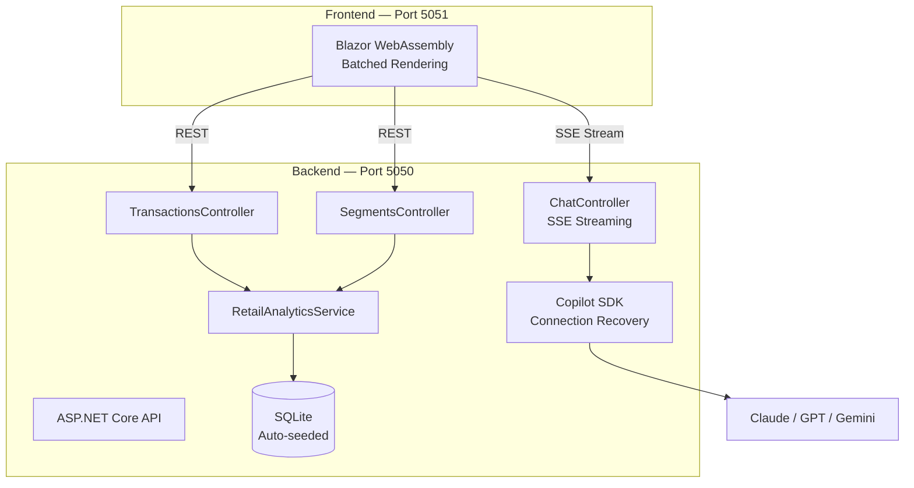

<a name="start-building"></a>
<!--
  Drop a banner image at img/banner.png and uncomment this block to enable it.
  <p align="center">
    
  </p>
-->

# AI Genius — シーズン 5、エピソード 2
※日本語版のステップガイドはこちら: https://tachaan.github.io/aigenius-copilotsdk-s5ep2/

## 🔥 Agent HQ: GitHub Copilot SDK で小売分析アシスタントを構築する

### セッション概要

チャット画面で動くエージェントも印象的ですが、その真価はチームが日常的に利用する
アプリケーションへ組み込んだときに発揮されます。このセッションでは、
**GitHub Copilot SDK** を基盤に小売取引分析アシスタントを構築します。
モデルのレスポンスを SSE でストリーミングする .NET 10 API、リアルタイムに描画する
Blazor フロントエンド、安全にリリースするためのガバナンス基盤（カスタムエージェント、
フック、監査証跡、コードスキャン）を扱います。

### セッションスライド

[`docs/`](docs/) を参照してください。「Three Mondays」のストーリーは
`Slide1.png` ～ `Slide3.png` に収録されています。

### 🧠 学習目標

このセッションを終えると、次のことができるようになります。

- GitHub Copilot SDK ランタイムを ASP.NET Core アプリケーションに組み込む
- Server-Sent Events を使用して、モデルのレスポンスをトークン単位でブラウザーへストリーミングする
- モデル一覧をハードコードして古くなるリスクを避け、実行時に利用可能なモデルを検出する
- カスタムエージェント、フック、監査ログ、コードスキャンによるエンタープライズガバナンスを
  AI 支援開発に適用する

### 💬 Copilot で学習を続ける

このセッションのトピックをさらに学ぶには、次のプロンプトを GitHub Copilot で試してください。
VS Code で Copilot Chat を開き（Windows/Linux は `Ctrl+Alt+I`、Mac は `Cmd+Shift+I`）、
プロンプトを貼り付けて結果を確認します。最新の公式ドキュメントを参照するには、
[Microsoft Learn MCP Server](#microsoft-learn-mcp-server)への接続も試してください。

以下を出発点として使用するか、独自のプロンプトを作成してください。

- *GitHub Copilot SDK では何を構築できますか？*
- *ASP.NET Core で Copilot SDK のレスポンスを Server-Sent Events 経由でストリーミングするにはどうすればよいですか？*
- *サインインしている Copilot アカウントで利用可能なモデルを一覧表示するにはどうすればよいですか？*
- *Copilot SDK の認証を設定するにはどうすればよいですか？*
- *Copilot フックとは何ですか？また、セキュリティゲートの適用にどう利用できますか？*

### 📚 リソースと次のステップ

| リソース | 説明 |
|:---------|:------------|
| [GitHub Copilot SDK リポジトリ](https://github.com/github/copilot-sdk) | サポートされるすべての言語向け SDK |
| [Copilot SDK 入門](https://github.com/github/copilot-sdk/blob/main/docs/getting-started.md) | 最初の Copilot 対応アプリを構築する |
| [Awesome Copilot](https://github.com/github/awesome-copilot) | カスタムエージェント、指示、スキル、フック、ワークフロー、プラグイン |
| [GitHub Copilot ドキュメント](https://docs.github.com/copilot) | 公式製品ドキュメント |

### 🌟 Microsoft Learn MCP Server

Microsoft Learn MCP Server を使用すると、AI エージェントから Microsoft の公式ドキュメントへ
直接アクセスでき、このセッションで扱う製品やサービスについて、根拠のある最新の回答を得られます。

**VS Code** — このリポジトリには [`.vscode/mcp.json`](.vscode/mcp.json) が含まれているため、
フォルダーを開くとサーバーが構成されます。

**GitHub Copilot CLI** — 次を実行して Learn MCP Server をプラグインとしてインストールします。

```
/plugin install microsoftdocs/mcp
```

詳細情報、ほかのクライアント、質問の投稿については、
[Learn MCP Server リポジトリ](https://aka.ms/learnmcp)を参照してください。

---

## ✨ このデモで紹介する内容

| 機能 | 確認できる内容 |
|------------|-----------------|
| **マルチモデル AI チャット** | Copilot CLI からリアルタイムに取得する常に最新のモデル一覧 |
| **小売分析ドメイン** | 取引データ、顧客セグメント、セグメント予測 |
| **リアルタイムストリーミング** | バッチ描画を伴うトークン単位の SSE レスポンス |
| **エンタープライズガバナンス** | 監査証跡、ポリシーフック、セキュリティゲート、コードスキャン |

## 🛠️ 技術スタック

同じアプリケーションを 2 つの言語で実装しています。好みの言語を選択してください。
どちらのトラックでも同じ SDK の概念を学び、同じ HTTP コントラクトを公開します。

| コンポーネント | .NET トラック | Python トラック |
|-----------|------------|--------------|
| ランタイム | .NET 10 LTS | Python 3.11+ ([uv](https://docs.astral.sh/uv/)) |
| AI SDK | GitHub Copilot SDK v1.0.9 | `github-copilot-sdk` v1.0.9 |
| バックエンド | ASP.NET Core Web API | FastAPI |
| フロントエンド | Blazor WebAssembly | Static HTML + vanilla JS |
| データベース | SQLite + EF Core | SQLite + SQLModel |
| モデルのデータアクセス | MCP (`ModelContextProtocol`) | MCP (`mcp`) |
| テスト | xUnit (26) | pytest (30) |
| Lint | Roslyn analysers | Ruff |
| ポート | 5050 API / 5051 UI | 5070 (API + UI) |

| 共通要素 | 技術 |
|--------|------------|
| CI/CD | GitHub Actions |
| セキュリティ | CodeQL、カスタムエージェント |

## 🚀 クイックスタート

### 閲覧用の公開と GitHub Pages

このリポジトリは、所有者と許可された共同編集者が更新する閲覧用資料として運用します。
外部からの変更提案は受け付けず、Issues・Pull requests・Wiki・Discussions は無効にします。
Public にしても外部閲覧者へ書き込み権限は付与されませんが、ソースと Git 履歴は公開され、
第三者による clone・fork・再配布を技術的に禁止することはできません。
コードと資料のライセンスは従来どおりです。

Pages の公開対象は MkDocs が `docs/` とこの README から生成する **`site/` のみ**です。
`site/` は生成物のためコミットせず、直接編集もしません。
図・画像・システムマップ・検索インデックスも公開対象に含まれます。
API・チャット・SQLite データベースを Pages 上で動かす構成ではありません。
Private の間は GitHub のアクセス権を持つ人がリポジトリを閲覧でき、
Pages 公開後のサイトは誰でも閲覧できます。

公開前に、Git 履歴を含むシークレット検査に加え、文章・画像・ログ・個人情報・内部情報を
目視確認してください。`Public release guard` は履歴の Gitleaks 検査、
`Docs site` は strict ビルドと生成物の拡張子・パス検査を行います。
これらは機密情報が一切ないことを保証せず、push 後の CI は Public 化前の確認の代わりにはなりません。

**公開は明示的な操作が必要です。現在の visibility を自動変更する処理はありません。**

1. この変更を `main` に反映し、`Public release guard` と `Docs site` の成功を確認します。
   現在の Private / Free 構成では Pages・ブランチ保護の有効化は保留です。
2. 公開判断後、所有者が GitHub で visibility を Public に変更します。
3. `pwsh -File scripts/configure_public_release.ps1` を実行し、Secret scanning / Push protection、
   main の削除・force push 防止、外部 fork の Actions 実行承認を設定します。
   スクリプトは Public 以外では変更せず停止します。
4. サイトの公開内容を確認後、同じスクリプトを `-EnablePages` 付きで実行します。
   Pages の Actions ソースと `github-pages` 環境の main 限定設定が成功した場合だけ
   `ENABLE_PAGES=true` を設定します。その後 `Docs site` を main に対して手動実行します。
5. 公開先 `https://Tachaan.github.io/aigenius-copilotsdk-s5ep2/` の表示を確認します。

`ENABLE_PAGES` の既定は無効です。Public 化だけではデプロイされません。
再び `false` にすると今後のデプロイは止まりますが、公開済みサイトは削除されません。
公開停止は GitHub の Pages 設定で別途行ってください。
デモ用 Issue 作成ワークフローも自動実行しません。必要な場合に限り Issues を有効化し、
`ENABLE_DEMO_SETUP=true` を設定して手動実行します。

### 前提条件

- [GitHub Copilot CLI](https://docs.github.com/copilot) — Copilot を利用できるアカウントで
  サインインしていること
- **.NET トラック:** [.NET 10 SDK](https://dotnet.microsoft.com/download)
- **Python トラック:** [Python 3.11+](https://www.python.org/downloads/) と
  [uv](https://docs.astral.sh/uv/getting-started/installation/)

### 実行 — .NET

```bash
dotnet restore src/AgentOrchestrator/AgentHQDemo.slnx
dotnet build   src/AgentOrchestrator/AgentHQDemo.slnx

# Terminal 1 — API (SQLite DB auto-created and seeded on first run)
dotnet run --project src/AgentOrchestrator/AgentHQDemo.Api --urls "http://localhost:5050"

# Terminal 2 — Blazor UI
dotnet run --project src/AgentOrchestrator/AgentHQDemo.Web --urls "http://localhost:5051"
```

次に <http://localhost:5051> を開きます。API はポート 5050 で実行されます。

### 実行 — Python

```bash
cd src/AgentOrchestrator-python
uv sync

# One server for both the API and the UI
uv run uvicorn app.main:app --port 5070
```

次に <http://localhost:5070> を開きます。

両方のスタックを同時に実行できるよう、意図的に異なるポートを使用しています。

### GitHub Codespaces

1. **Code** → **Create codespace on main** をクリックします
2. セットアップが完了するまで待ちます（約 2 分）
3. 選択したトラックのコマンドを実行します

### Copilot CLI バイナリ

Copilot SDK はビルド時に、対応する CLI バイナリを `registry.npmjs.org` からダウンロードします。
企業プロキシやオフライン環境などでレジストリに接続できない場合、ビルドは `MSB3923` で失敗します。
[`Directory.Build.props`](Directory.Build.props) は、グローバルにインストールされた Copilot CLI が
存在する場合にそれを再利用して、この問題を回避します。

```bash
npm install -g @github/copilot
```

必要に応じて、検出を上書きまたは無効化できます。

```bash
dotnet build -p:CopilotCliBinaryPath=/path/to/copilot   # use a specific binary
dotnet build -p:CopilotUseLocalCli=false                # always download
```

## 📡 API エンドポイント

| エンドポイント | メソッド | 説明 |
|----------|--------|-------------|
| `/api/chat/stream` | POST | ストリーミングチャット（SSE） |
| `/api/chat/models` | GET | 利用可能な AI モデル（Copilot CLI からリアルタイムに取得） |
| `/api/chat/health` | GET | 正常性チェック |
| `/api/transactions` | GET/POST | トランザクションの一覧表示または追加 |
| `/api/transactions/{id}` | GET/DELETE | ID を指定したトランザクション |
| `/api/segments` | GET | 顧客セグメント |
| `/api/segments/{id}` | GET | セグメントの詳細 |
| `/api/segments/predict/{customerId}` | GET | 顧客セグメントの予測 |

### 呼び出し例

```bash
# Stream a chat response
curl -N -X POST http://localhost:5050/api/chat/stream \
  -H "Content-Type: application/json" \
  -d '{"prompt": "Which segment has the lowest retention?", "model": "claude-haiku-4.5"}'

# List transactions (10 seed records)
curl http://localhost:5050/api/transactions

# Predict customer segment
curl http://localhost:5050/api/segments/predict/C003
# → {"customerId":"C003","predictedSegment":"High Value","confidence":0.89,...}
```

## 🎯 利用可能なモデル

モデル選択リストは、実行時に `GET /api/chat/models` から取得されます。このエンドポイントは、
サインイン中のアカウントが実際に利用できるモデルを Copilot CLI に問い合わせます。
正確な一覧はアカウントによって異なり、時間とともに変化します。例として、
`claude-haiku-4.5`（既定）、`auto`、`claude-sonnet-*`、`claude-opus-*`、
`gpt-5.*`、`gemini-*` があります。

> API が Copilot CLI に接続できない場合、API と UI は少数の固定モデル一覧へフォールバックするため、
> デモの表示は継続できます。

## 🏗️ アーキテクチャ



## 📂 プロジェクト構成

```
.
├── .devcontainer/              # Codespaces configuration
├── .github/
│   ├── agents/                 # Custom Copilot agents
│   ├── hooks/                  # Governance + audit hooks
│   ├── prompts/                # Reusable prompts
│   ├── skills/                 # Copilot skills
│   ├── workflows/              # CI, CodeQL, setup
│   ├── copilot-instructions.md # Coding standards for all agents
│   └── copilot-review-instructions.md
├── .vscode/mcp.json            # MS Learn MCP server
├── docs/                       # Labs, walkthroughs, and reference material
├── img/                        # Session branding
├── src/
│   ├── AgentOrchestrator/          # .NET implementation
│   │   ├── AgentHQDemo.Api/        # Web API — chat, transactions, segments
│   │   ├── AgentHQDemo.McpServer/  # Read-only MCP server over retail.db
│   │   ├── AgentHQDemo.Web/        # Blazor WebAssembly UI
│   │   ├── samples/SdkLabs/        # Runnable lab samples
│   │   ├── tests/                  # xUnit tests (26)
│   │   └── AgentHQDemo.slnx        # Solution
│   └── AgentOrchestrator-python/   # Python implementation
│       ├── app/                    # FastAPI — routers, services, models, UI
│       ├── mcp_server/             # Read-only MCP server over retail.db
│       ├── sdk_labs/               # Runnable lab samples
│       ├── tests/                  # pytest tests (30)
│       └── pyproject.toml          # uv project
├── AGENTS.md                   # Guidelines for AI agents
└── Directory.Build.props       # Copilot CLI resolution
```

## 🗄️ シードデータ

SQLite データベースは初回起動時に自動作成されます。5 人の顧客（C001～C005）、
4 つのカテゴリ、4 つの店舗にわたる **10 件のトランザクション**に加え、次のデータが含まれます。

| セグメント | 顧客数 | 平均支出額 | 維持率 |
|---------|-----------|-----------|-----------|
| High Value | 150 | $850 | 92% |
| Regular | 3,200 | $180 | 78% |
| At Risk | 890 | $95 | 45% |
| New | 420 | $120 | 65% |

## 🤖 カスタムエージェント

| エージェント | 用途 | 専門分野 |
|-------|---------|-----------|
| `dotnet-reviewer` | .NET コードレビュー | セキュリティ、パフォーマンス、ベストプラクティス |
| `security-scanner` | 脆弱性の検出 | OWASP Top 10、インジェクションリスク |
| `pr-summary` | PR ドキュメント | コンテキストを考慮した説明 |

## 📋 デモ資料

完全なドキュメントは [`docs/`](docs/) にあり、トラック別に分類されています。

| トラック | ラボ | デモ |
|:------|:-----|:------|
| **.NET** | [7 つの Copilot SDK 演習](docs/labs/)（約 2 時間）— [ラボ 01](docs/labs/01-setup/)から開始 | `src/AgentOrchestrator/` のコードを解説する[ウォークスルー](docs/demos/) |
| **Python** | [同じ 7 つの演習](docs/labs-python/) — [ラボ 01](docs/labs-python/01-setup/)から開始 | `src/AgentOrchestrator-python/` のコードを解説する[ウォークスルー](docs/demos-python/) |

両方ではなく、**どちらか一方**のトラックに取り組んでください。学習内容は同じです。

どちらのトラックにも属さない内容は、
[**Breakouts**](docs/breakouts/) にまとめています。

| グループ | 内容 |
|:------|:-----------|
| リファレンス | [アーキテクチャ](docs/breakouts/architecture.md)、[カスタムエージェント](docs/breakouts/custom-agents.md)、[フック](docs/breakouts/hooks-and-governance.md)、[スキル](docs/breakouts/skills.md)、[トラブルシューティング](docs/breakouts/troubleshooting.md) |
| 追加ハンズオン | 両トラック共通の Copilot CLI ラボ — [カスタムエージェント](docs/labs/extra-custom-agents/)、[ガバナンスフック](docs/labs/extra-governance-hooks/) |

## 🔐 セキュリティに関する注意

このデモには、コードレビューや静的解析のデモ中に検出できるよう、問題のあるコードパターンを
**意図的に**含めています。

| 問題 | .NET | Python |
|:-----|:-----|:-------|
| N+1 クエリ（パフォーマンスレビュー） | `GetTransactionsWithSegmentsAsync` | `get_transactions_with_segments` |
| null チェック不足（静的解析） | `GetTransactionAsync` | `get_transaction` |
| 入力検証不足（セキュリティレビュー） | `AddTransactionAsync` | `add_transaction` |
| ハードコードされたしきい値（コードスメル） | `PredictSegmentAsync` | `predict_segment` |

両方の実装に同じ 4 つの問題があるため、どちらのトラックにも同じ解答例を使用できます。

一方、チャットのデータベースアクセスは問題点ではありません。両トラックとも、
SQLite を `Mode=ReadOnly` で開く読み取り専用 MCP サーバー
（`AgentHQDemo.McpServer` / `mcp_server/`）を通じて `retail.db` をモデルに公開し、
汎用クエリツールではなく 5 つの特定ドメイン向けツールを提供します。REST API は ORM への
直接アクセスを維持します。MCP はモデル用であり、アプリケーションが自身のデータベースと通信するためのものではありません。

**これらの問題に対処せず、本番環境で使用しないでください。**
[`SECURITY.md`](SECURITY.md) を参照してください。

> **CodeQL に関する注意:** コードスキャンには GitHub Advanced Security が必要なため、
> このリポジトリがプライベートである間は解析をスキップします。リポジトリをパブリックにすると
> 自動的に実行されます。または、リポジトリ変数 `ENABLE_CODEQL=true` を設定してください。

## 🤝 コントリビューション

リポジトリのガイドラインは [`AGENTS.md`](AGENTS.md)、コミュニティ標準は
[`CODE_OF_CONDUCT.md`](CODE_OF_CONDUCT.md)、サポートを受ける方法は
[`SUPPORT.md`](SUPPORT.md) を参照してください。

## 📄 ライセンス

- **コード** — [MIT License](LICENSE)
- **ドキュメントとコンテンツ** — [CC BY 4.0](LICENSE-DOCS)

---

[GitHub Copilot SDK](https://github.com/github/copilot-sdk) を使用して ❤️ を込めて構築しました
