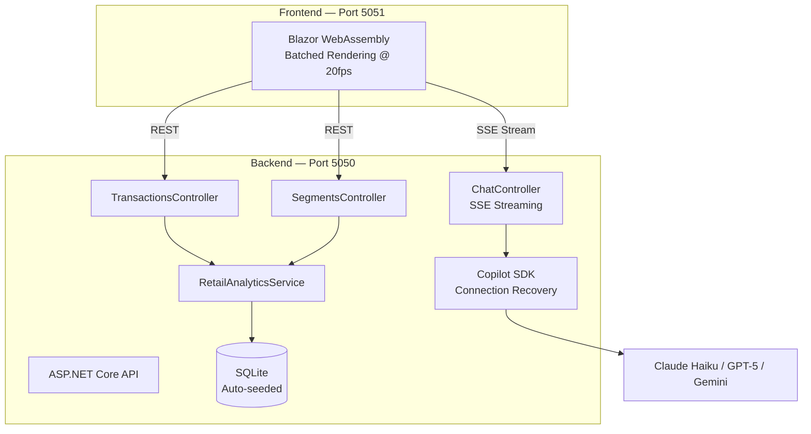

# Agent HQ Demo — Retail Analytics Assistant

A full-stack .NET 10 demo application showcasing **modern AI-assisted development** with GitHub Copilot SDK, multi-agent workflows, and enterprise governance patterns. Built around a **retail transaction analytics** domain relevant to enterprise data teams.


## 🎯 What This Demo Shows

Modern AI development isn't just autocomplete—it's about AI that **understands your entire codebase**, **works autonomously**, and **integrates with enterprise workflows**.

| Capability | What You'll See |
|------------|-----------------|
| **Multi-Model AI Chat** | Switch between GPT-5, Claude Haiku/Sonnet/Opus, Gemini—all in one UI |
| **Retail Analytics Domain** | Transaction data, customer segments, segment prediction |
| **Real-Time Streaming** | Token-by-token SSE responses with batched rendering |
| **Enterprise Governance** | Audit trails, policy controls, security gates on AI-generated code |

## ✨ Features

- **📊 Retail Analytics Assistant** — Business-focused AI chat for retail insights
- **🎯 Multi-Model Support** — Claude Haiku 4.5 (default), GPT-5, GPT-4.1, Claude Sonnet/Opus 4.5, Gemini 2.5 Pro
- **⚡ Optimized Streaming** — Batched UI rendering at 20fps, `ResponseHeadersRead`, connection recovery
- **🗄️ SQLite Database** — 10 seed transactions, 4 customer segments, auto-created on startup
- **🔒 Enterprise Security** — CodeQL scanning, dependency review, custom security agents
- **🚀 Codespaces Ready** — One-click development environment with all AI tools pre-configured

## 🛠️ Tech Stack

| Component | Technology |
|-----------|------------|
| Runtime | .NET 10 LTS |
| AI SDK | GitHub Copilot SDK v1.0.9 |
| Backend | ASP.NET Core Web API |
| Frontend | Blazor WebAssembly |
| Database | SQLite + EF Core |
| Default Model | Claude Haiku 4.5 (fastest) |
| CI/CD | GitHub Actions |
| Security | CodeQL, Custom Agents |

## 🚀 Quick Start

### Option 1: GitHub Codespaces (Recommended)
1. Click **Code** → **Open with Codespaces**
2. Wait for environment setup (~2 minutes)
3. Run: `dotnet run --project src/AgentHQDemo.Api --urls "http://localhost:5050"`
4. In a second terminal: `dotnet run --project src/AgentHQDemo.Web --urls "http://localhost:5051"`
5. Open http://localhost:5051

### Option 2: Local Development
```bash
# Prerequisites: .NET 10 SDK
git clone https://github.com/viperdanorg/agenthq-demo.git
cd agenthq-demo
dotnet restore
dotnet build

# Terminal 1: Start API (SQLite DB auto-created on first run)
dotnet run --project src/AgentHQDemo.Api --urls "http://localhost:5050"

# Terminal 2: Start Blazor UI
dotnet run --project src/AgentHQDemo.Web --urls "http://localhost:5051"
```

Then open http://localhost:5051 for the Blazor UI (API runs on 5050).

### Copilot CLI binary

The Copilot SDK downloads a matching Copilot CLI binary from `registry.npmjs.org` during
build. If that registry is unreachable (corporate proxy, offline machine) the build fails
with `MSB3923`. `Directory.Build.props` works around this by reusing a globally installed
Copilot CLI when one is present:

```bash
npm install -g @github/copilot   # or: brew install copilot
```

Override or disable the detection if needed:

```bash
dotnet build -p:CopilotCliBinaryPath=/path/to/copilot   # use a specific binary
dotnet build -p:CopilotUseLocalCli=false                # always download
```

## 📡 API Endpoints

| Endpoint | Method | Description |
|----------|--------|-------------|
| `/api/chat/stream` | POST | Streaming chat (SSE) |
| `/api/chat/models` | GET | Available AI models |
| `/api/chat/health` | GET | Health check |
| `/api/transactions` | GET/POST | List or add transactions |
| `/api/transactions/{id}` | GET/DELETE | Transaction by ID |
| `/api/segments` | GET | Customer segments |
| `/api/segments/{id}` | GET | Segment details |
| `/api/segments/predict/{customerId}` | GET | Predict customer segment |

### Example API Calls

```bash
# Stream a chat response
curl -X POST http://localhost:5050/api/chat/stream \
  -H "Content-Type: application/json" \
  -d '{"prompt": "Who are our highest spending customers?", "model": "claude-haiku-4.5"}'

# List transactions (10 seed records)
curl http://localhost:5050/api/transactions

# Predict customer segment
curl http://localhost:5050/api/segments/predict/C003
# → {"customerId":"C003","predictedSegment":"High Value","confidence":0.89,...}

# List customer segments
curl http://localhost:5050/api/segments
```

## 🎯 Available Models

The model picker is populated at runtime from `GET /api/chat/models`, which asks the
Copilot CLI which models the signed-in account can actually use. The exact list varies
by account and changes over time — examples include:

| Model | Provider | Best For |
|-------|----------|----------|
| `claude-haiku-4.5` ⚡ | Anthropic | Fast responses (default) |
| `auto` | GitHub | Let Copilot pick automatically |
| `claude-sonnet-*` | Anthropic | Balanced analysis |
| `claude-opus-*` | Anthropic | Deep reasoning |
| `gpt-5.*` | OpenAI | Complex reasoning |
| `gemini-*` | Google | Large context |

> If the API can't reach the Copilot CLI, both the API and the UI fall back to a small
> static catalog so the demo still renders.

## 🏗️ Architecture



## 📂 Project Structure

```
agenthq-demo/
├── .devcontainer/          # Codespaces configuration
├── .github/
│   ├── agents/             # Custom Copilot agents
│   ├── workflows/          # CI/CD pipelines (build, CodeQL)
│   └── copilot-instructions.md
├── src/
│   ├── AgentHQDemo.Api/    # .NET Web API (Backend)
│   │   ├── Controllers/    # Chat, Transactions, Segments
│   │   ├── Data/           # RetailDbContext (SQLite)
│   │   ├── Models/         # Transaction, CustomerSegment, SegmentPrediction
│   │   └── Services/       # RetailAnalyticsService, CopilotChatService
│   └── AgentHQDemo.Web/    # Blazor WebAssembly (Frontend)
│       ├── Components/     # Header, Message, ChatInput, SuggestionChips
│       ├── Pages/          # Home (main chat page)
│       ├── Services/       # ChatService (SSE), StorageService
│       └── wwwroot/        # Static assets, CSS themes
├── tests/
│   └── AgentHQDemo.Tests/  # 5 xUnit tests (in-memory SQLite)
└── docs/
    ├── DEMO-PLAN.md        # Three Mondays demo plan
    ├── demo-script.md      # Generic demo talk track
```

## 🗄️ Seed Data

The SQLite database is auto-created on first startup with:

**10 Transactions** across 5 customers (C001-C005), 4 categories, 4 stores:
| Customer | Amount | Category | Store |
|----------|--------|----------|-------|
| C001 | $245.50 | Grocery | S001 |
| C003 | $1,250.00 | Electronics | S002 |
| C005 | $675.00 | Electronics | S002 |
| ... | ... | ... | ... |

**4 Customer Segments:**
| Segment | Customers | Avg Spend | Retention |
|---------|-----------|-----------|-----------|
| High Value | 150 | $850 | 92% |
| Regular | 3,200 | $180 | 78% |
| At Risk | 890 | $95 | 45% |
| New | 420 | $120 | 65% |

## 🤖 Custom Agents

| Agent | Purpose | Specialty |
|-------|---------|-----------|
| `dotnet-reviewer` | .NET code review | Security, performance, best practices |
| `security-scanner` | Vulnerability detection | OWASP Top 10, injection risks |
| `pr-summary` | PR documentation | Context-aware descriptions |

## 📋 Demo Materials

- **[Demo Plan](docs/DEMO-PLAN.md)** — Three Mondays framework
- **[Demo Script](docs/demo-script.md)** — Capability-focused talk track

## 🔐 Security Notes

This demo intentionally includes code patterns for code review demonstrations:
- N+1 query in `GetTransactionsWithSegmentsAsync` (performance review)
- Missing null check in `GetTransactionAsync` (static analysis)
- No input validation in `AddTransactionAsync` (security review)
- Hardcoded threshold in `PredictSegmentAsync` (code smell)

**Do not use in production without addressing these.**

## 📄 License

MIT License — See [LICENSE](LICENSE) for details.

---

Built with ❤️ using [GitHub Copilot SDK](https://docs.github.com/en/copilot/building-copilot-extensions/building-a-copilot-agent-for-your-copilot-extension/using-the-copilot-platform-api)
