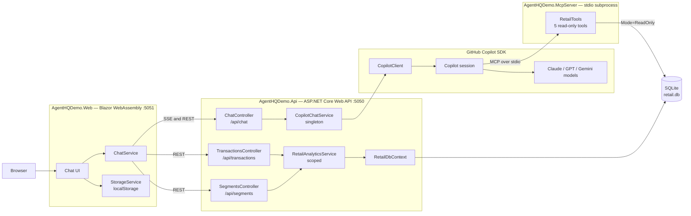
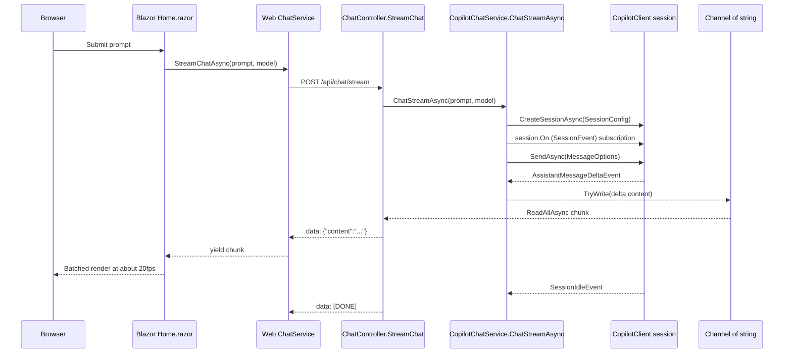
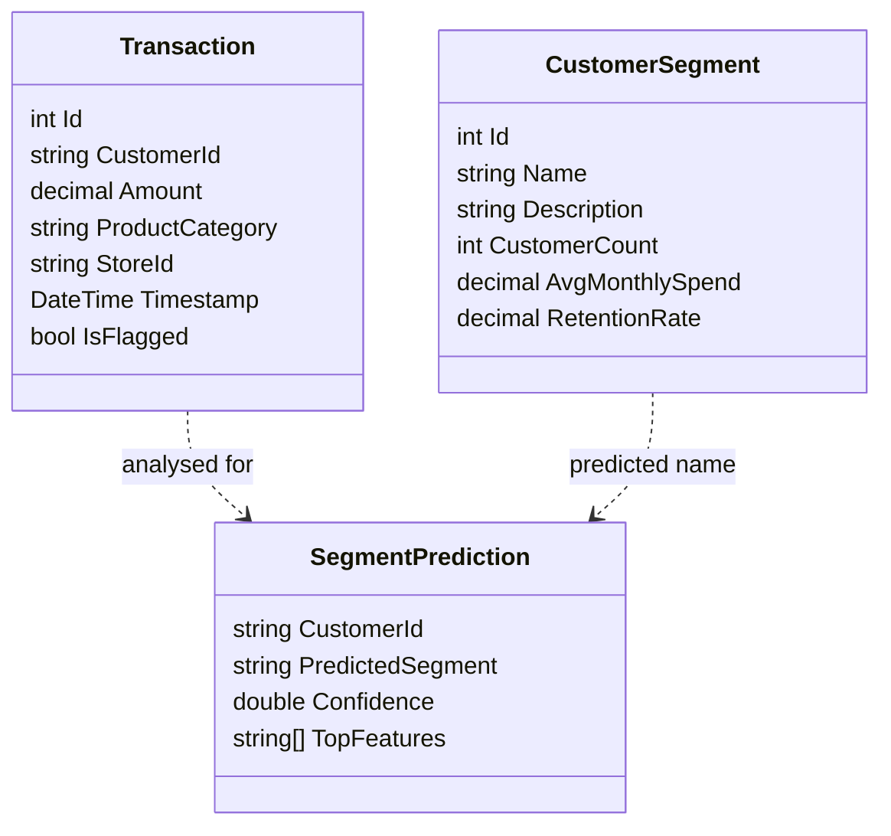

# アーキテクチャ

このページは、AI Genius S5E2 Agent HQ デモのシステムリファレンスです。
.NET 10 Blazor WebAssembly フロントエンド、ASP.NET Core Web API、
GitHub Copilot SDK 統合、構成不要の SQLite 分析ストアの概要を説明します。

!!! tip "実際に探索してみますか?"

    [システムマップ](../system-map/)では、同じアーキテクチャを対話型の図として
    確認できます。ノードの検索、ルートの追跡、3 つのガイド付きビューの再生が可能です。

## コンポーネントビュー

デモは、ポート 5051 の Blazor WebAssembly UI とポート 5050 の API という、
2 つのローカルプロセスとして実行されます。API の `Program.cs` は、
`CopilotChatService` をシングルトンとして、`RetailAnalyticsService` を
`RetailDbContext` を使用するスコープ付きサービスとして登録します。



`retail.db` への経路が 2 つに分かれている点に注目してください。REST
コントローラーは `RetailDbContext` を介して直接読み書きします。一方、
*モデル*が同じデータベースにアクセスする経路は MCP サーバーだけです。
接続は `Mode=ReadOnly` で開かれ、サーバーが公開する 5 つのドメインツール
からのみ利用できます。MCP はモデルのためのものであり、アプリケーションが
自身のデータベースと通信するためのものではありません。

## SSE チャットシーケンス

`AgentHQDemo.Web.Services.ChatService.StreamChatAsync` は、
`HttpCompletionOption.ResponseHeadersRead` を指定して `/api/chat/stream` に
POST します。API は `text/event-stream` を設定し、チャンクごとにフラッシュして、
`data: [DONE]` でストリームを終了します。



## データモデル

`RetailDbContext` は `Transactions` セットと `Segments` セットを公開します。
セグメント予測は SQLite に保存されず、`RetailAnalyticsService` からレコードとして
返されます。



## リポジトリ構成

実装は `src/AgentOrchestrator/` 以下にあり、API、UI、テストが個別の
プロジェクトに分かれています。

```text
src/AgentOrchestrator/
├── AgentHQDemo.Api/
│   ├── Controllers/
│   ├── Data/
│   ├── Models/
│   ├── Services/
│   └── Program.cs
├── AgentHQDemo.Web/
│   ├── Components/
│   ├── Layout/
│   ├── Pages/
│   ├── Services/
│   └── Program.cs
├── tests/
│   └── AgentHQDemo.Tests/
└── AgentHQDemo.slnx
```

## 主な設計判断

- **シングルトンの Copilot クライアント**:
    `AgentHQDemo.Api.Services.CopilotChatService` はシングルトンとして登録され、
    長期間存続する 1 つの `CopilotClient` を保持します。`EnsureStartedAsync` は
    接続が失われた後にクライアントを再作成します。
- **ストリーミング用の Channel ブリッジ**:
    Copilot SDK のコールバックは、アシスタントの差分を容量無制限の
    `Channel<string>` に書き込みます。API はチャネルを `IAsyncEnumerable<string>`
    として読み取り、各項目を SSE フレームに変換します。
- **実行時のモデル検出**:
    `CopilotChatService.ListModelsAsync` は実行時に Copilot SDK を呼び出します。
    CLI に接続できない場合やモデルが返されない場合、`ChatController.GetModels` は
    静的カタログにフォールバックします。
- **構成不要の分析用 SQLite**:
    `Program.cs` は `UseSqlite("Data Source=retail.db")` を使用し、
    `EnsureCreatedAsync` を呼び出して、起動時にサンプルの小売データをシードします。

## 関連情報

- [カスタムエージェント](./custom-agents.md)
- [フックとガバナンス](./hooks-and-governance.md)
- [トラブルシューティング](./troubleshooting.md)
- [API `Program.cs`](https://github.com/vicperdana/aigenius-copilotsdk-s5ep2/blob/main/src/AgentOrchestrator/AgentHQDemo.Api/Program.cs)
- [`CopilotChatService`](https://github.com/vicperdana/aigenius-copilotsdk-s5ep2/blob/main/src/AgentOrchestrator/AgentHQDemo.Api/Services/CopilotChatService.cs)
- [Web `ChatService`](https://github.com/vicperdana/aigenius-copilotsdk-s5ep2/blob/main/src/AgentOrchestrator/AgentHQDemo.Web/Services/ChatService.cs)
