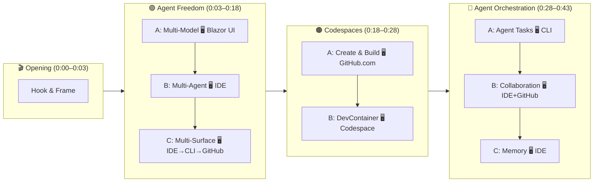

# Agent HQ Demo Script — Retail Edition

**Duration:** ~45 minutes  
**Vertical:** Retail / E-commerce (adaptable to any industry)  
**Theme:** Agent Freedom | Cloud Development Environments | Agent Orchestration  
**Narrative Arc:** One codebase, three acts — freedom to choose, consistency to scale, orchestration to deliver

---

## 🎯 SHARP Presenter Guide

> **Use the SHARP principles throughout this demo. Each section is tagged with the SHARP element it leverages.**

| Principle | What It Means | How to Use It |
|-----------|---------------|---------------|
| **S** — Stories | Lead with a relatable micro-story. Make the audience *feel* the problem before you solve it. | One story per section. Sensory, specific, personal. |
| **H** — Humor | Take the subject seriously, yourself lightly. Smile. | Developer humor — self-deprecating, never forced. |
| **A** — Analogies | Translate abstract platform concepts into everyday things. | Warehouse, recipe card, head chef — objects they know. |
| **R** — References | Drop 1–2 memorable quotes. It's fine to read them. | Use references of personal significance. |
| **P** — Pictures | Less text, more live demo. Point at the screen. Let the product speak. | The Mermaid diagram anchors the journey visually. |

---

## Demo Flow



---

## Pre-Demo Checklist

- [ ] Repo ready: `agenthq-demo` with seed issues + CI passing
- [ ] .NET 10 SDK installed, `dotnet build` succeeds
- [ ] Run API: `dotnet run --project src/AgentOrchestrator/AgentHQDemo.Api --urls "http://localhost:5050"`
- [ ] Run Blazor UI: `dotnet run --project src/AgentOrchestrator/AgentHQDemo.Web --urls "http://localhost:5051"`
- [ ] Verify: `curl http://localhost:5050/api/transactions` returns 10 records
- [ ] Verify: `curl http://localhost:5050/api/segments` returns 4 segments
- [ ] Open Blazor UI at http://localhost:5051 — confirm chat responds
- [ ] Default model set to Claude Haiku 4.5 (fastest for demos)
- [ ] Copilot Chat working in VS Code (multi-model selection visible)
- [ ] Copilot CLI installed (`copilot` command available)
- [ ] Codespace tested: can create and build from GitHub.com
- [ ] Browser tabs: GitHub repo, Codespaces dashboard

---

## Opening (0:00–0:03)

> 📖 **S — Story:**

> "A few months ago I was talking with an engineering leader at an online retailer — 200 engineers, catalog team, fulfillment team, digital storefront. Black Friday is two weeks out. He tells me: *'Half my engineers are using Copilot. Some are using Claude. A few are on Cursor. And when our CISO asked which AI tools touched checkout code last quarter, nobody had an answer.'*"

> "That's the tension. Your engineers want **freedom** to pick the best tools. Your org needs **consistency** so every environment is production-ready. And somewhere in between, you need AI that doesn't just write code — it actually **ships software**."

> 🅰️ **A — Analogy:** *"It's like having a warehouse full of forklifts — different brands, different controls — but no inventory system. Everyone's productive, but nobody can tell the warehouse manager what moved where."*

> "Three sections. Forty-five minutes. No slides after this."

**Frame the three sections:**
- 🟣 **Agent Freedom** — any model, any agent, any surface — no lock-in
- 🟠 **Cloud Development Environments** — consistent, secure, ready-to-code environments
- 🔵 **Agent Orchestration** — agents that plan, code, test, fix, and remember

---

## Section 1: Agent Freedom 🟣 (0:03–0:18)

> *"Our goal with GitHub Copilot isn't to lock you into a model, an agent, or a tool. It's to give your teams freedom to choose the best tool for the job."*

### Part A: Multi-Model (0:03–0:08)

> 🖥️ **Surface: Blazor UI** (http://localhost:5051)

**Product Truth:** Access the latest and greatest models in the IDE.

**Live demo:**
1. Open the Copilot SDK chat in Blazor UI
2. Show the model dropdown — Claude Haiku 4.5, GPT-5, Gemini 2.5 Pro, etc.
3. Ask a retail question: *"Who are our highest spending customers?"* — show Claude responding
4. Switch models — ask the same question with GPT-5, compare the response

> 🖼️ **P — Visual:** Let the model selector dropdown do the talking. Click it open, pause, let the room read the list. Simple. Bold.

**Say:** "Different models, different strengths. Claude reasons deeply about business logic. GPT-5 is fast for code generation. Gemini handles multimodal. Your engineers choose — Agent HQ provides access to all of them."

> 😄 **H — Humor:** *"And yes — Claude is right there in the dropdown. No side deals, no shadow IT, no one sneaking API keys into environment variables at 2am."*

### Part B: Multi-Agent (0:08–0:14)

> 🖥️ **Surface: IDE** (VS Code — file explorer + Copilot Chat)

**Product Truth:** Access multiple agents within GitHub, as well as in the IDE.

**Live demo:**
1. Show `.github/agents/` directory — dotnet-reviewer, security-scanner, pr-summary, a11y-auditor
2. Open an agent file — show the YAML frontmatter (name, description, tools)
3. Show `copilot-instructions.md` — one file teaches ALL agents your standards
4. Show subagent chains: `dotnet-reviewer.agent.md` calls `security-scanner`

> 📖 **S — Story:** *"Your checkout team ships a PR updating payment logic. The dotnet-reviewer checks for .NET anti-patterns. It automatically chains to the security-scanner, which checks for OWASP issues. Two agents, one trigger, zero manual handoff."*

**Say:** "Every agent inherits your standards, your conventions, and your security policies automatically. Different agents for different jobs — same interface, same governance."

### Part C: Multi-Surface (0:14–0:18)

> 🖥️ **Surface: IDE → CLI → GitHub.com** (switch between all three)

**Product Truth:** Work on your phone, the CLI, IDE, or even GitHub.com.

**Live demo:**
1. **IDE:** Show Copilot Chat — ask *"Explain the retail analytics service architecture"*
2. **CLI:** Run `copilot` — show it detects the repo, loads instructions automatically
3. **GitHub.com:** Show agent review comments on a PR

> 🅰️ **A — Analogy:** *"Think of it like a retail chain — your brand is consistent whether customers walk into a store, open the app, or call the help line. Same agents, same models, same memory — every surface."*

**Say:** "IDE, terminal, GitHub.com, even mobile. You work where you work, and we come to you."

---

## Section 2: Cloud Development Environments 🟠 (0:18–0:28)

> *"A consistent, secure, and ephemeral environment means every developer starts from the same place — no 'works on my machine' surprises."*

### Part A: Codespaces Basics (0:18–0:24)

> 🖥️ **Surface: GitHub.com → Codespace** (browser-based VS Code)

**Product Truth:** Full cloud development environments, ready in seconds.

> 📖 **S — Story:** *"It's Black Friday week. A new engineer joins the fulfillment team. In the old world, three days of setup — install the SDK, configure the database, chase down environment variables. By the time they're productive, the sale is over."*

**Live demo:**
1. Navigate to the repo on GitHub.com
2. Click "Code" → "Create codespace on main"
3. Show the environment spinning up — full VS Code in the browser
4. Run `dotnet build` — everything works out of the box, no local setup

> 😄 **H — Humor:** *"Three days of setup or three minutes of clicking? I know which one my manager prefers during peak season."*

**Say:** "This is the same environment every developer on the team gets. No setup guides, no dependency conflicts. Click and code."

### Part B: Dev Container Configuration (0:24–0:28)

> 🖥️ **Surface: Codespace** (continue in browser-based VS Code)

**Product Truth:** Codespaces are defined as code, version-controlled and reproducible.

> 🅰️ **A — Analogy:** *"Think of it like a recipe card. Every ingredient, every step, written down. A new chef doesn't guess — they follow the recipe and get the same result every time."*

**Live demo:**
1. Open `.devcontainer/devcontainer.json` — show the environment definition
2. Walk through key settings: base image, extensions, post-create commands
3. **Key point:** The environment is code-reviewed and version-controlled, just like application code

**Say:** "Your dev environment is a file in the repo. Versioned, reviewed, and consistent across every developer and every branch."

> 📜 **R — Reference:** *"Consistency is not the enemy of creativity — it's the foundation." Your environment spec frees engineers to focus on the code, not the setup.*

---

## Section 3: Agent Orchestration 🔵 (0:28–0:43)

> *"Instead of prompting an agent again and again, you define the full job once. Plan, code, test, fix, and review run together as a single task."*

### Part A: Agent Tasks (0:28–0:36)

> 🖥️ **Surface: CLI** (Copilot CLI in terminal)

**Product Truth:** Decouple coding agent from PRs *(private preview)*.

> 📖 **S — Story:** *"Your data engineer finds a bug — a hardcoded threshold in the order processing logic that should be configurable. She opens Claude, asks for a fix. Gets 15 lines. Pastes them in. Tests fail. Goes back to Claude, pastes the error. New fix. Two tests still fail. Twenty minutes later, the AI wrote the code but she did all the engineering."*

> 🅰️ **A — Analogy:** *"That's a sous chef who can chop vegetables brilliantly but can't cook a meal. What if the sous chef could run the entire kitchen?"*

**Live demo:**

**Step 1: Launch Copilot CLI** (0:28–0:29)
```
Terminal: copilot
Talk:    "Back in the CLI. It detects the repo, loads copilot-instructions.md automatically.
          Let's define a full task — not a prompt, a complete job."
```

**Step 2: Plan mode — define the job** (0:29–0:31)
```
Action:  Shift+Tab to switch to Plan mode
Prompt:  "Analyse PredictSegmentAsync and plan how to make the threshold configurable"
Talk:    "Plan mode creates a structured plan before any code is written.
          Review the steps, ask questions, steer — then give the go-ahead."
```
- AI creates a plan: extract threshold to config, update service, add tests
- Review the plan in the dedicated panel

**Step 3: Execute the plan** (0:31–0:33)
```
Action:  Shift+Tab to switch back to Normal mode, let the agent implement
Talk:    "Now it executes. Watch — editing the service, updating config, writing tests.
          One task, multiple stages, clear outcomes."
```
- Show the agent making changes across multiple files
- Run `/diff` to review what changed — dual-column diff view

**Step 4: Show trust levels** (0:33–0:34)
```
Talk:    "Three levels of trust — you choose how much autonomy the agent gets."
```

| Mode | How to activate | What it does |
|------|----------------|-------------|
| **Normal** | Default | Agent asks permission for every action |
| **`/yolo`** (`/allow-all`) | Type `/allow-all` | Auto-approves permissions, runs freely |
| **Autopilot** | Shift+Tab to cycle | End-to-end autonomous — plans, codes, tests, iterates until done |

**Step 5: Delegate to coding agent** (0:34–0:36)
```
Terminal: /delegate "Fix the N+1 query in GetTransactionsWithSegmentsAsync"
Talk:     "I've finished the threshold fix. The N+1 query is a separate task —
           I'll delegate it to the coding agent."
```
- Show: CLI commits changes to a new branch, opens a draft PR
- Talk: "The agent works asynchronously on GitHub. I get a PR when it's done."

> 😄 **H — Humor:** *"We named it /yolo for a reason. For production repos, maybe use Autopilot instead — it's /yolo with a seatbelt."*

**Say:** "This is the difference between an assistant and an agent. An assistant suggests. An agent delivers."

### Part B: Agent Collaboration (0:36–0:41)

> 🖥️ **Surface: CLI → IDE → GitHub.com** (fleet in CLI, agent config in IDE, PR on GitHub.com)

**Product Truth:** Agent Sessions at the repository level.

**Live demo:**

**Step 1: /fleet — parallel collaboration** (0:36–0:38)
```
Terminal: /fleet "Explore the RetailAnalyticsService for anti-patterns, run all tests, and review for security issues"
Talk:     "One command. Three agents. All running in parallel."
```
- Show: explore agent analyses code, task agent runs `dotnet test`, code-review agent checks vulnerabilities — simultaneously
- Results stream back as each agent finishes

> 🅰️ **A — Analogy:** *"Think of it like a pit crew — not one person changing all four tyres, but four specialists working simultaneously. Same car, same goal, different expertise, done in seconds."*

**Step 2: Show the subagent chain config** (0:38–0:39)
```
Action: Open .github/agents/dotnet-reviewer.agent.md in IDE
Point:  Highlight the YAML frontmatter — tools: ['agent', 'read', 'search']
Talk:   "The 'agent' tool means this reviewer can call other agents.
         It automatically invokes the security-scanner after its own review."
```

> **Fleet vs Subagents — when to use each:**
>
> | Pattern | When to use | Example |
> |---------|-------------|---------|
> | **/fleet** (parallel) | Independent tasks — all run simultaneously | Explore + test + review at once |
> | **Subagents** (sequential) | Dependent tasks — output feeds the next | .NET review → then security check |
>
> *"Fleet for breadth, subagents for depth."*

**Step 3: Multi-agent PR review** (0:39–0:41)

> 💡 **Tip:** Use a PR that's already open (e.g., from a prior coding agent run or a pre-prepared branch) to avoid waiting for /delegate to complete.

```
Action: Open an existing PR on GitHub.com
Talk:   "Now let's layer on multiple agent perspectives — same PR, different expertise."
```

Add the following comments on the PR, one at a time:
```
@copilot review for performance issues — we process millions of transactions at peak
```
```
@claude check for security issues and missing input validation
```
```
@dotnet-reviewer check for .NET anti-patterns
```
- Show: Each agent responds with a different perspective
  - @copilot: focuses on performance (N+1 queries, caching, allocations)
  - @claude: focuses on security (input validation, null checks, data exposure)
  - @dotnet-reviewer: chains to @security-scanner automatically after its review
- Talk: "Three agents, three perspectives, one PR. And the dotnet-reviewer triggered the security-scanner on its own — no manual handoff."

**Step 4: Human steers** (0:41–0:41)
```
Action: Reply to an agent comment — "focus on the PredictSegmentAsync method"
Talk:   "You steer the agents, not the other way around. Redirect, refine, override."
```

> 🖼️ **P — Visual:** Point at the PR as agent comments appear. Let the audience watch multiple perspectives land on the same change. The visual *is* the message.

**Say:** "This feels more like pair programming than automation running in the background. Fleet for breadth, subagents for depth — one review triggers a chain automatically."

### Part C: Agent Memory (0:41–0:43)

> 🖥️ **Surface: IDE** (VS Code — show files in editor)

**Product Truth:** Copilot now has memory built into 1P and 3P agents.

**Live demo:**

**Step 1: Instructions as persistent memory** (0:41–0:42)
```
Action: Open .github/copilot-instructions.md in IDE
Point:  Scroll through the coding standards, naming conventions, async patterns
Talk:   "This isn't just configuration — it's agent memory. Every model, every agent,
         every surface reads this file. Context that carries forward across sessions and people."
```

**Step 2: Skills as reusable knowledge** (0:42–0:43)
```
Action: Open .github/skills/ directory — show the 3 skills (data-pipeline-conventions,
        demo-verifier, ml-model-review)
        Open one SKILL.md — show the YAML frontmatter (name, description)
Talk:   "Skills go further — structured, reusable knowledge packages. A skill for data pipeline
         conventions, a skill for ML model review. Agents load them when the task is relevant."
```

> 🅰️ **A — Analogy:** *"It's the difference between a contractor who asks 'how do you want this done?' every single time, and a teammate who already knows your standards. Memory turns agents from contractors into team members."*

**Say:** "Context, decisions, and artifacts carry forward. That's what makes this reliable and repeatable — not a one-off demo that falls apart."

---

## Commands Cheat Sheet

```bash
# ─── Build and run ───
dotnet build
dotnet run --project src/AgentOrchestrator/AgentHQDemo.Api --urls "http://localhost:5050"
dotnet run --project src/AgentOrchestrator/AgentHQDemo.Web --urls "http://localhost:5051"

# ─── Verify seed data ───
curl http://localhost:5050/api/transactions | jq       # Expect 10 records
curl http://localhost:5050/api/segments | jq            # Expect 4 segments
curl http://localhost:5050/api/segments/predict/C003 | jq

# ─── Run tests ───
dotnet test

# ══════════════════════════════════════════════════════════════
# SECTION 1: AGENT FREEDOM 🟣 (0:03–0:18)
# Story: "Half my engineers use Copilot, some use Claude, a few on Cursor...
#          CISO asked which AI tools touched checkout code — nobody had an answer."
# Analogy: Warehouse full of forklifts, no inventory system.
# ══════════════════════════════════════════════════════════════

# 🖥️ Blazor UI (Part A: Multi-Model) — http://localhost:5051
# Open model dropdown, ask same question with 2 models, compare
"Who are our highest spending customers?"
"Analyze transaction trends by category"

# 🖥️ IDE (Part B: Multi-Agent) — VS Code file explorer + Chat
# Show .github/agents/, open dotnet-reviewer.agent.md, show copilot-instructions.md
# Story: "Checkout team ships a PR → dotnet-reviewer chains to security-scanner"

# 🖥️ IDE → CLI → GitHub.com (Part C: Multi-Surface) — show all three
copilot                                    # Launch CLI, show repo detection
"Explain the retail analytics service architecture"   # IDE Copilot Chat prompt
# Open a PR on GitHub.com — show agent review comments
# Analogy: Retail chain — brand consistent across store, app, help line.

# ══════════════════════════════════════════════════════════════
# SECTION 2: CODESPACES 🟠 (0:18–0:28)
# Story: "Black Friday week. New engineer joins fulfillment team.
#          Three days of setup — by the time they're productive, the sale is over."
# Analogy: Recipe card — every ingredient, every step, written down.
# ══════════════════════════════════════════════════════════════

# 🖥️ GitHub.com → Codespace (Part A: Basics)
# github.com → Code → Create codespace on main
# Run in Codespace terminal:
dotnet build                               # Everything works, no local setup

# 🖥️ Codespace (Part B: DevContainer)
# Open .devcontainer/devcontainer.json — walk through base image, extensions
# Quote: "Consistency is not the enemy of creativity — it's the foundation."

# ══════════════════════════════════════════════════════════════
# SECTION 3: AGENT ORCHESTRATION 🔵 (0:28–0:43)
# Story: "Data engineer finds hardcoded threshold. Opens Claude, gets 15 lines.
#          Tests fail. Goes back, pastes error. 20 min later — AI wrote code,
#          she did all the engineering."
# Analogy: Sous chef who chops brilliantly but can't cook a meal.
#          What if the sous chef could run the entire kitchen?
# ══════════════════════════════════════════════════════════════

# 🖥️ CLI (Part A: Agent Tasks)
# Shift+Tab to toggle Plan mode / Normal mode / Autopilot mode
# Plan mode prompt:
"Analyse PredictSegmentAsync and plan how to make the threshold configurable"
# Switch back to Normal mode (Shift+Tab), let agent execute
/diff                                      # Review changes (dual-column)
/allow-all                                 # Auto-approve permissions (/yolo)
/delegate "Fix the N+1 query in GetTransactionsWithSegmentsAsync"
# Humor: "/yolo with a seatbelt = Autopilot"

# ─── Trust levels (know the difference) ───
# Normal:    Agent asks before every action (default)
# /allow-all (/yolo): Auto-approves permissions, agent still pauses between steps
# Autopilot: Agent works end-to-end autonomously until task is complete

# 🖥️ CLI (Part B Step 1: /fleet — parallel agents)
/fleet "Explore the RetailAnalyticsService for anti-patterns, run all tests, and review for security issues"
# Analogy: Pit crew — four specialists, same car, different expertise, done in seconds.
# "Fleet for breadth, subagents for depth."

# 🖥️ IDE (Part B Step 2: Subagent config)
# Open .github/agents/dotnet-reviewer.agent.md — tools: ['agent', 'read', 'search']

# 🖥️ GitHub.com (Part B Step 3: Multi-agent PR review — use PRE-EXISTING PR)
"@copilot review for performance issues — we process millions of transactions at peak"
"@claude check for security issues and missing input validation"
"@dotnet-reviewer check for .NET anti-patterns"
# → dotnet-reviewer auto-chains to security-scanner

# 🖥️ GitHub.com (Part B Step 4: Human steers)
# Reply to agent comment: "focus on the PredictSegmentAsync method"

# 🖥️ IDE (Part C: Memory)
# Open .github/copilot-instructions.md — frame as "agent memory"
# Open .github/skills/ — show data-pipeline-conventions, demo-verifier, ml-model-review
# Analogy: Contractor vs teammate. Memory turns agents into team members.

# ─── Blazor UI suggestion chips (🖥️ Blazor UI) ───
"Who are our highest spending customers?"
"Analyze transaction trends by category"
"Which customer segments are at risk of churn?"
"What stores have the highest average transaction value?"
"Show me the customer segment distribution"
```

---

## Quick Narrative Recall

| Section | Story Hook | Analogy | Humor / Quote |
|---------|-----------|---------|---------------|
| **Opening** | Eng leader, Black Friday, CISO asks "which AI touched checkout code?" — no answer | Warehouse full of forklifts, no inventory system | — |
| **🟣 Freedom A** | — | — | "No one sneaking API keys into env vars at 2am" |
| **🟣 Freedom B** | Checkout PR → dotnet-reviewer chains to security-scanner | — | — |
| **🟣 Freedom C** | — | Retail chain — consistent across store, app, help line | — |
| **🟠 Codespaces A** | Black Friday week, new engineer, 3 days of setup | — | "3 days or 3 minutes? I know which my manager prefers" |
| **🟠 Codespaces B** | — | Recipe card — every ingredient written down | *"Consistency is not the enemy of creativity"* |
| **🔵 Orchestration A** | Data engineer, hardcoded threshold, 20 min of copy-paste | Sous chef → head chef running the kitchen | "/yolo with a seatbelt = Autopilot" |
| **🔵 Orchestration B** | — | Pit crew — 4 specialists, done in seconds | "Fleet for breadth, subagents for depth" |
| **🔵 Orchestration C** | — | Contractor vs teammate | "Not a one-off demo that falls apart" |
