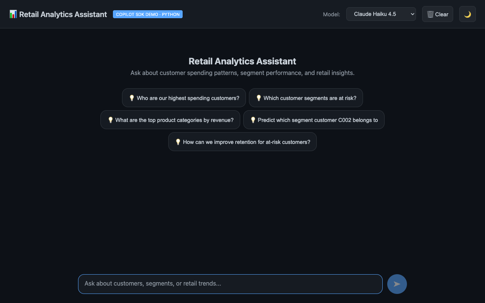
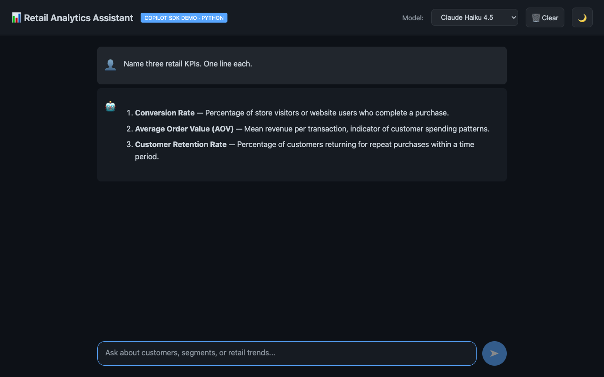

# ブラウザー UI

このウォークスルーでは、Python 版小売分析 API と同じ FastAPI アプリから配信される静的ブラウザークライアントを説明します。`index.html` は UI の構造、`app.js` は状態管理と API 通信を担うコンポーネントです。FastAPI によるファイル配信、Vanilla JavaScript によるチャット応答の逐次描画、ローカル設定の永続化、モデル選択 UI と動的なモデル一覧との整合方法を順に確認します。

## アプリの構成とポート

Python UI は、静的 HTML コンポーネントの [`app/static/index.html`](https://github.com/vicperdana/aigenius-copilotsdk-s5ep2/blob/main/src/AgentOrchestrator-python/app/static/index.html) と、JavaScript コンポーネントの [`app/static/app.js`](https://github.com/vicperdana/aigenius-copilotsdk-s5ep2/blob/main/src/AgentOrchestrator-python/app/static/app.js) で構成されています。Blazor WebAssembly ではなく、FastAPI から配信されます。

ビルド手順も WebAssembly ランタイムのダウンロードもありません。その代わり、コンポーネントモデル、コンパイル時の UI 型安全性、生成済みのクライアントコードもありません。

ポート **5070** の 1 つのサーバーが API と UI の両方を配信します。これは、API が **5050**、Blazor UI が **5051** で動く .NET トラックとは異なります。ページと API のスキーム、ホスト、ポートが同じなのでブラウザーからのリクエストは同一オリジンになり、通常の UI 経路では CORS の許可設定は不要です。CORS は異なるオリジン間のリクエストを制御する仕組みであり、中継処理ではありません。

⚠️ ポート選定は任意ではありません。Chrome、Edge、Firefox はポート **5060**（SIP）を明示的に遮断するため、そこから UI を配信すると、`curl` は成功してもブラウザでは `ERR_UNSAFE_PORT` になります。ブラウザが読み込むもののポートを選ぶときは、5060、5061、6000 を避けてください。

初期状態では、ページに歓迎メッセージの見出しと 5 つのリテール向け質問候補が表示されます。



## FastAPI への静的ファイルのマウント

[`app/main.py`](https://github.com/vicperdana/aigenius-copilotsdk-s5ep2/blob/main/src/AgentOrchestrator-python/app/main.py) では、先に API ルーターを登録します。

```python
app.include_router(chat.router)
app.include_router(transactions.router)
app.include_router(segments.router)
```

その後で、静的アプリを `/` にマウントします。

```python
# Mounted last so it does not shadow the /api routes above.
app.mount("/", StaticFiles(directory=STATIC_DIR, html=True), name="static")
```

⚠️ この順序は重要です。`StaticFiles` は `/` にマウントされるため、ルーターより前にマウントすると `/api/...` のリクエストを覆い隠してしまいます。

## `index.html`

[`index.html`](https://github.com/vicperdana/aigenius-copilotsdk-s5ep2/blob/main/src/AgentOrchestrator-python/app/static/index.html) には、ページ全体の骨組みが含まれています。ヘッダー、モデル選択 UI、Clear ボタン、テーマ切り替え、メッセージ領域、歓迎パネル、質問候補、テキスト入力欄、送信ボタンがここにあります。

```html
<h1>📊 Retail Analytics Assistant</h1>
<span class="badge">Copilot SDK Demo · Python</span>
```

このページは、Markdown の描画と構文強調表示のために `marked` と `highlight.js` を CDN から読み込みます。スタイルシートは [`app/static/app.css`](https://github.com/vicperdana/aigenius-copilotsdk-s5ep2/blob/main/src/AgentOrchestrator-python/app/static/app.css) で、Blazor 専用ルールを削ったうえで Blazor プロジェクトからコピーされており、両トラックの見た目が同じになるようにしています。

## ページの状態とローカルストレージ

[`app.js`](https://github.com/vicperdana/aigenius-copilotsdk-s5ep2/blob/main/src/AgentOrchestrator-python/app/static/app.js) は、Blazor の `Home.razor` ページと同じ状態を保持します。

```javascript
let messages = [];
let selectedModel = 'claude-haiku-4.5';
let isDark = true;
let isStreaming = false;
```

メッセージ、選択中のモデル、テーマは、Blazor クライアントと同じキーで永続化されます。

```javascript
const STORAGE_KEYS = {
    messages: 'chat_messages',
    model: 'selected_model',
    theme: 'theme',
};
```

`loadState()` はページ読み込み時にこれらの値を復元し、`setTheme()` はルート要素のクラス、highlight.js のテーマ、`localStorage` の値を更新します。

## モデル選択 UI

モデル選択 UI は `GET /api/chat/models` を取得します。

```javascript
const res = await fetch('/api/chat/models');
```

API は `{id, name, description}` から成る JSON の**一覧**を返します。UI はその一覧を、Blazor の `ChatService` が使う ID からラベルへの辞書形式に変換します。

```javascript
const list = await res.json();
if (Array.isArray(list) && list.length > 0) {
    models = Object.fromEntries(
        list.filter((m) => m.id).map((m) => [m.id, m.name || m.id])
    );
}
```

API に到達できない場合、ページは 6 つのモデルから成る静的カタログ（`claude-haiku-4.5`、`gpt-4.1`、`gpt-5`、`claude-sonnet-4.5`、`claude-opus-4.5`、`gemini-2.5-pro`）にフォールバックします。`localStorage` に保存された古いモデルは、利用可能なら `claude-haiku-4.5` に、そうでなければ動的に取得した一覧の先頭のモデルに置き換えられます。

## ストリーミング描画

`sendMessage()` はユーザーのメッセージを追加し、空のアシスタント応答領域を作成してから、SSE エンドポイントへ POST します。

```javascript
const res = await fetch('/api/chat/stream', {
    method: 'POST',
    headers: { 'Content-Type': 'application/json' },
    body: JSON.stringify({ prompt, model: selectedModel }),
});
```

⚠️ **このフィールド名は動作上きわめて重要です。** 以前の版では
`{ message: prompt, ... }` を送っていました。`ChatRequest` は `prompt` を宣言しており、Pydantic は未知のキーを拒否せず無視します。そのため、リクエストは 200 となりストリーム応答も返りましたが、入力されたプロンプトは黙って破棄されていました。エラーは発生せず、モデルは単に空の質問へ回答していただけです。

これは、クライアントとサーバーの境界で寛容なパーサーを使う典型的な危険性です。そのため `tests/test_chat_contract.py` では、`app.js` が POST するフィールドと、`ChatRequest` が読むフィールドが一致していることを検証しています。

レスポンス本文は `fetch()`、`res.body.getReader()`、`TextDecoder` で読み取られます。

```javascript
const reader = res.body.getReader();
const decoder = new TextDecoder();
let buffer = '';
```

読み取ったデータは毎回デコードして行ごとに分割し、末尾の未完了行は次回の読み取りまで保持します。

```javascript
buffer += decoder.decode(value, { stream: true });
const lines = buffer.split('\n');
buffer = lines.pop() ?? '';
```

パーサーは `data: ` フレームを探し、`[DONE]` を完了を示すセンチネルとして認識し、`content` の値だけを追加します。サーバーは `[DONE]` の後でレスポンスを閉じるため、読み取りループは終了します。

```javascript
if (!line.startsWith('data: ')) continue;
const payload = line.slice(6);
if (payload === '[DONE]') continue;
```

## 描画の間引き

UI は 50 ms 間隔、つまりおおよそ 1 秒あたり 20 フレームで再描画します。

```javascript
const timer = setInterval(() => {
    if (!needsRender) return;
    needsRender = false;
    messages[messages.length - 1].content = content;
    renderMessages();
}, 50);
```

これは Blazor クライアントの描画タイマーに対応する仕組みです。高速なモデルは数百個のデルタを生成し得るため、トークンごとに再描画するとブラウザーの処理を無駄にし、スクロールも不安定になります。

## 入力欄、候補、テーマ

入力内容はボタンのクリック、または Shift なしの Enter で送信されます。入力欄はストリーミング中は無効になり、応答完了後にフォーカスが戻ります。質問候補は入力欄と同じ送信経路を使い、`Who are our highest spending customers?` や `Predict which segment customer C002 belongs to` のような文字列を送ります。テーマボタンはダークモードとライトモードを切り替え、使用中の highlight.js スタイルシートも切り替えます。

上記の経路を通して描画された、完了済みのやり取りは次のとおりです。



## 関連項目

- [Copilot SDK の組み込み](./01-copilot-sdk-integration.md)
- [SSE によるストリーミング応答](./02-sse-streaming.md)
- [小売ドメイン](./03-retail-analytics.md)
- ソース: [`index.html`](https://github.com/vicperdana/aigenius-copilotsdk-s5ep2/blob/main/src/AgentOrchestrator-python/app/static/index.html), [`app.js`](https://github.com/vicperdana/aigenius-copilotsdk-s5ep2/blob/main/src/AgentOrchestrator-python/app/static/app.js), [`app.css`](https://github.com/vicperdana/aigenius-copilotsdk-s5ep2/blob/main/src/AgentOrchestrator-python/app/static/app.css), [`main.py`](https://github.com/vicperdana/aigenius-copilotsdk-s5ep2/blob/main/src/AgentOrchestrator-python/app/main.py), [`chat.py`](https://github.com/vicperdana/aigenius-copilotsdk-s5ep2/blob/main/src/AgentOrchestrator-python/app/routers/chat.py)
