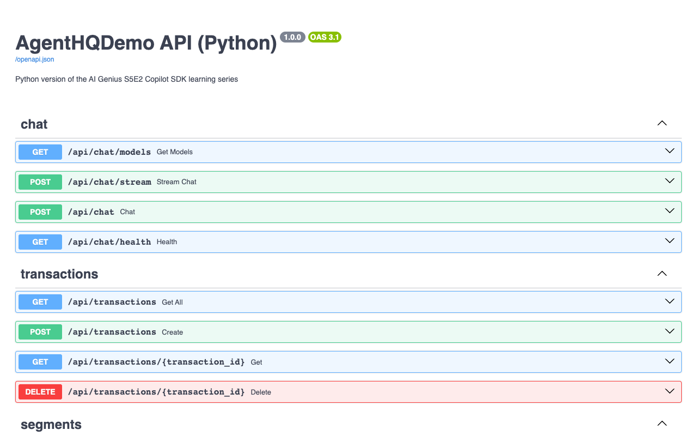

# Extra — API を拡張する

> **📎 追加ラボ — Copilot SDK ではありません。**
> これはデモアプリにおける FastAPI、SQLModel、pytest を扱います。Copilot を*コーディング支援*として使いますが、Copilot SDK 自体には触れません。
> 任意で取り組めるもので、番号付き SDK 学習経路から独立しています。

**目的:** Copilot を使って新しいエンドポイントとそのテストを追加し、既存の 30 テストをすべて成功させたまま、意図的に残してあるコードスメルを維持します。

**所要時間:** 約30分

**前提条件:** [ラボ 01 — セットアップ](../01-setup/) を完了しており、Python アプリを実行できること。共有の追加ラボ [governance-hooks](../../labs/extra-governance-hooks/) を完了している場合は、作業中もその hooks を有効のままにしてください。

## ⚠️ ルール

1. **意図的に残した 4 つのコードスメルを修正しないでください。** 後続のデモがそれらに依存しています。Copilot が `get_transactions_with_segments` の整理を提案しても断ってください。
2. **既存の 14 テストをすべて通したままにしてください。** 新しいテストはその数に追加されます。
3. 既存の Python 規約に従ってください。薄いルーター、SQLModel / Pydantic の DTO、非同期サービスメソッド、pytest のフィクスチャ、そして [`AGENTS.md`](https://github.com/vicperdana/aigenius-copilotsdk-s5ep2/blob/main/AGENTS.md) にある作業上の規則を守ります。

## これから作るもの

`GET /api/segments/summary` — すべてのセグメントを横断したポートフォリオ全体の統計を返します。

```json
{
  "totalSegments": 4,
  "totalCustomers": 4660,
  "weightedAverageRetention": 0.71,
  "highestRetention": "High Value",
  "lowestRetention": "At Risk"
}
```

これは意図的に単純な受け渡し処理にはしていません。加重平均では顧客数を使って維持率を重み付けする必要があり、まさにテストすべき種類のロジックです。

## ステップ 1 — 既存の形を調べる

```bash
cd src/AgentOrchestrator-python
cat app/routers/segments.py
cat app/services/retail_analytics.py
cat app/models.py
cat app/main.py
```

真似すべきパターンは次のとおりです。

- `APIRouter(prefix="/api/segments", tags=["segments"])`
- `Depends(get_service)` による依存性注入
- ルートデコレーター上の `response_model=...`
- リソースが見つからない場合の `HTTPException(status_code=404)`
- ルーターは薄く保ち、ロジックは `RetailAnalyticsService` に置くこと
- `app/main.py` はライフスパンハンドラーで初期データを投入し、`/` に静的 UI を**最後に**マウントして `/api` ルートを覆い隠さないこと

## ステップ 2 — Python 側の違いを把握する

モデルは `app/models.py` にあり、**SQLModel** を使います。⚠️ SQLModel は `table=True` のクラスでは検証を省略するため、取引関連の制約付きフィールドは `TransactionBase` に置かれています。`Transaction`（テーブルモデル）と `TransactionCreate`（リクエスト本文）の両方がそれを継承します。

JSON は通信時には **camelCase**（`customerId` であり `customer_id` ではない）です。これは Pydantic の `alias_generator=to_camel` 設定で実現されています。これにより .NET の HTTP コントラクトを意図的に維持しており、同じ `curl` コマンドをどちらのトラックにも使えます。

テストは `tests/conftest.py` のインメモリ SQLite エンジンと `StaticPool` を使う pytest 構成です。`StaticPool` はすべての接続を同じインメモリデータベースに向け続けます。これは .NET 側で `OpenConnection()` が果たしている役割と同じです。pytest テストは 14 本あり、.NET トラックの 14 本の xUnit テストと一致します。

## ステップ 3 — DTO を追加する

`app/models.py` に次のレスポンスモデルを追加します。

```python
class SegmentSummary(BaseModel):
    """Portfolio-level statistics across all customer segments."""

    model_config = CAMEL_CONFIG

    total_segments: int
    total_customers: int
    weighted_average_retention: float
    highest_retention: str
    lowest_retention: str
```

これは SQLite テーブルではなく API のデータ形式なので、`BaseModel` で十分です。共有の `CAMEL_CONFIG` によって、レスポンスは `totalSegments` や `weightedAverageRetention` になります。

## ステップ 4 — サービスメソッドを追加する

制約を先に伝えたうえで、Copilot に次のように依頼してください。

```
Add an async get_segment_summary method to RetailAnalyticsService that returns a
SegmentSummary. Weight the average retention by customer_count, not a plain
mean. Handle the empty-segment case without throwing. Follow the existing
conventions in this file. Do not modify any other method.
```

目指す形は次のとおりです。

```python
async def get_segment_summary(self) -> SegmentSummary:
    segments = await self.get_segments()
    if not segments:
        return SegmentSummary(
            total_segments=0, total_customers=0, weighted_average_retention=0,
            highest_retention="", lowest_retention="",
        )

    total_customers = sum(s.customer_count for s in segments)
    weighted = 0 if total_customers == 0 else (
        sum(s.retention_rate * s.customer_count for s in segments) / total_customers
    )

    return SegmentSummary(
        total_segments=len(segments),
        total_customers=total_customers,
        weighted_average_retention=round(weighted, 2),
        highest_retention=max(segments, key=lambda s: s.retention_rate).name,
        lowest_retention=min(segments, key=lambda s: s.retention_rate).name,
    )
```

⚠️ **ゼロ除算を防いでください。** `total_customers` がゼロだと例外になります。初期データが入った状態では起きにくいですが、テストでは空の状態を作れますし、レビューでも必ず指摘されます。

## ステップ 5 — エンドポイントを追加する

`app/routers/segments.py` で `SegmentSummary` をインポートし、次を追加します。

```python
@router.get("/summary", response_model=SegmentSummary)
async def summary(
    service: RetailAnalyticsService = Depends(get_service),
) -> SegmentSummary:
    return await service.get_segment_summary()
```

⚠️ **ルートの並び順に注意してください。** `/summary` は `/{segment_id}` より前に置いてください。FastAPI のルートは宣言順で評価されるため、そうしないと包括的なセグメントルートが先に `summary` を拾い、非整数 ID として検証で失敗する前にマッチしてしまいます。

## ステップ 6 — テストを書く

`tests/test_retail_analytics.py` のサービステストを Copilot に依頼します。

```
Add pytest tests for get_segment_summary. Cover: the seeded four-segment case,
correct weighted average (not a plain mean), and an empty database returning
zeros without throwing. The fixture starts empty, so seed explicitly.
```

初期データは次のとおりです。

| セグメント | 顧客数 | 維持率 |
|:--------|----------:|----------:|
| 高価値（High Value） | 150 | 0.92 |
| 通常（Regular） | 3,200 | 0.78 |
| 要注意（At Risk） | 890 | 0.45 |
| 新規（New） | 420 | 0.65 |

単純平均だと `0.70` になります。加重平均は `(150×0.92 + 3200×0.78 + 890×0.45 + 420×0.65) / 4660 ≈ 0.71` です。

```python
async def test_get_segment_summary_weights_retention_by_customer_count(
    service: RetailAnalyticsService,
) -> None:
    await service.seed_data()

    summary = await service.get_segment_summary()

    assert summary.total_segments == 4
    assert summary.total_customers == 4660
    assert summary.highest_retention == "High Value"
    assert summary.lowest_retention == "At Risk"
    assert summary.weighted_average_retention == 0.71
    assert summary.weighted_average_retention != 0.70
```

💡 さらに、空のデータベースに対して合計値がゼロで、`highest_retention` と `lowest_retention` が空文字列になることを確認するテストも追加してください。

## ステップ 7 — lint と test を実行する

```bash
uv run ruff check .
uv run pytest
```

期待される結果は、Ruff がクリーンに終了し、pytest が **14 本より多い** テストの成功を報告し、失敗がないことです。

⚠️ これまで通っていたテストが失敗した場合は、新しいコード以外の部分まで変わっています。差分を確認してください。

```bash
git diff --stat
```

表示されるのは `app/models.py`、`app/services/retail_analytics.py`、`app/routers/segments.py`、そしてテスト ファイルのみであるべきです。

## ステップ 8 — 実際に動かして確認する

```bash
uv run uvicorn app.main:app --port 5070
```

```bash
curl -s http://localhost:5070/api/segments/summary | jq
curl -s http://localhost:5070/api/segments | jq 'length'          # 4
curl -s http://localhost:5070/api/segments/predict/C003 | jq -r .predictedSegment
```

summary の値が上の表と一致することを確認してください。

FastAPI は型ヒントから OpenAPI を生成するため、新しいルートは追加作業なしで <http://localhost:5070/docs> の対話型ドキュメントにも現れます。宣言したレスポンスモデルがそのまま文書化されたスキーマになります。



💡 **.NET トラックでも同じ発想を OpenAPI ドキュメントとして公開しています。** 違いは、ここではスキーマが C# の属性ではなく、Pydantic モデルと Python の型ヒントから作られることです。

## ステップ 9 — HTTP contract を再確認する

FastAPI の検証には、すぐに分かる違いが 1 つあります。無効な入力に対して **HTTP 422** と Pydantic のエラー本文を返し、.NET 版のように `ModelState` から 400 を返すわけではありません。

実際に確認済みの不正入力に対する出力は次のとおりです。

```bash
$ curl -X POST http://localhost:5070/api/transactions \
    -H 'Content-Type: application/json' \
    -d '{"customerId":"C777","amount":-5,"productCategory":"Grocery","storeId":"S001"}'
{"detail":[{"type":"greater_than_equal","loc":["body","amount"],"msg":"Input should be greater than or equal to 0.01","input":-5,"ctx":{"ge":0.01}}]}
```

有効な create は **HTTP 201** を返します。ある確認済みの実行では次のレスポンスが返りました。

```json
{"productCategory":"Grocery","customerId":"C777","amount":42.5,"isFlagged":false,"storeId":"S001","id":11,"timestamp":"2026-08-13T04:59:38.478798"}
```

削除と未検出時の動作は次のとおりです。

```bash
curl -X DELETE http://localhost:5070/api/transactions/11   # HTTP 204, no body
curl -s http://localhost:5070/api/transactions/999
```

```json
{"detail":"Not Found"}
```

## ステップ 10 — 自分の変更をレビューする

```bash
copilot -p "Review my uncommitted Python changes for correctness, FastAPI route ordering, SQLModel/Pydantic validation, and pytest coverage. Report only." --allow-all-tools
```

その後、ルートの [`README.md`](https://github.com/vicperdana/aigenius-copilotsdk-s5ep2/blob/main/README.md) にある API の表を更新して新しいエンドポイントを載せてください。ドキュメントと実装のずれもレビュー指摘の対象です。

## ✅ チェックポイント

- [x] 新しいレスポンス DTO、サービスメソッド、エンドポイントを追加した
- [x] テストが weighted average と empty case をカバーしている
- [x] 元の 30 テストがすべて通ったままである
- [x] 4 つの意図的な smells に触れていない
- [x] ポート 5070 で動く API に対してエンドポイントを確認した
- [x] 既存の validation、create、delete、404 の振る舞いが期待どおりのままである

## 💡 発展課題

`GET /api/transactions/summary` を追加してください。product category と store ごとの合計を返すものです。`get_transactions_with_segments` にある N+1 パターンが紛れ込まないかを考え、それが起きないように実装してください。

## 関連

- 次へ: [Lab 07 — まとめ](../07-wrap-up/)
- [Python ラボ一覧](../README.md)
- [Python app README](https://github.com/vicperdana/aigenius-copilotsdk-s5ep2/blob/main/src/AgentOrchestrator-python/README.md)
- [デモ: 小売分析](../../demos-python/)
- [ブレイクアウト: トラブルシューティング](../../breakouts/troubleshooting.md)
