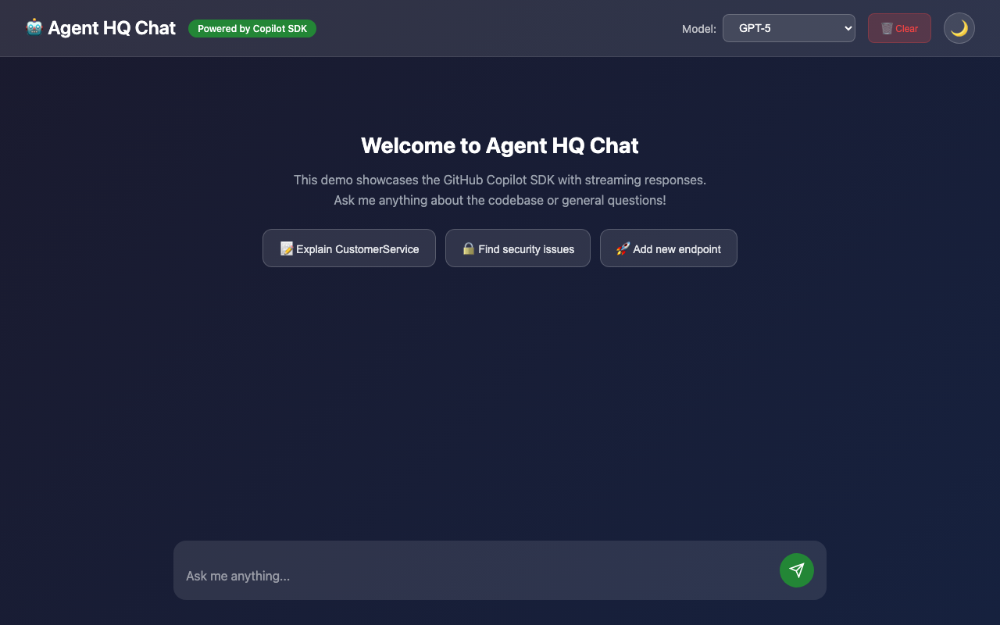

# ラボ 01 — セットアップ

**目標:** Agent HQ デモアプリを、SDK セッション、ストリーミング、サンプルを
実行するための基盤として使用し、Copilot SDK を扱う環境を準備します。

**所要時間:** 約15分

## 前提条件

[ラボの README](../README.md#prerequisites)を参照してください。要約すると、.NET 10 SDK、
サインイン済みの GitHub Copilot CLI、`curl`、`jq` が必要です。

## 手順 1 — クローンして確認する

```bash
git clone https://github.com/vicperdana/aigenius-copilotsdk-s5ep2.git
cd aigenius-copilotsdk-s5ep2
```

まず、内容を確認します。

```bash
ls
```

この構成は Microsoft Build のセッションリポジトリ規則に従っています。.NET の実装は
`src/AgentOrchestrator/` にあり、プロジェクトとテストの両方が含まれています。

⚠️ **リポジトリルートにはソリューションファイルがありません。**
`src/AgentOrchestrator/AgentHQDemo.slnx` にあるため、ビルドとテストのコマンドでは
明示的に指定します。ルートで引数なしの `dotnet build` を実行すると `MSB1003` で失敗します。

## 手順 2 — 復元してビルドする

```bash
dotnet restore src/AgentOrchestrator/AgentHQDemo.slnx
dotnet build   src/AgentOrchestrator/AgentHQDemo.slnx
```

想定される出力:

```
Build succeeded.
    0 Warning(s)
    0 Error(s)
```

⚠️ **`MSB3923: Failed to download file ... registry.npmjs.org` が表示された場合**、
ネットワークによって npm レジストリがブロックされています。Copilot SDK はビルド時に
対応する CLI バイナリをダウンロードします。代わりに CLI をグローバルインストールして再ビルドしてください。
[`Directory.Build.props`](https://github.com/vicperdana/aigenius-copilotsdk-s5ep2/blob/main/Directory.Build.props) が検出して再利用します。

```bash
npm install -g @github/copilot
```

すべてのオーバーライドについては、[トラブルシューティング](../../breakouts/troubleshooting.md)を参照してください。

## 手順 3 — テストを実行する

```bash
dotnet test src/AgentOrchestrator/AgentHQDemo.slnx
```

想定される出力:

```
Passed!  - Failed: 0, Passed: 26, Skipped: 0, Total: 26
```

この数を覚えておいてください。ラボ 05 では、これらを壊さずにテストを追加します。

## 手順 4 — API を起動する

1つ目のターミナルで、次を実行します。

```bash
dotnet run --project src/AgentOrchestrator/AgentHQDemo.Api --urls "http://localhost:5050"
```

初回実行時に SQLite データベースが自動的に作成され、シードデータが投入されます。
EF Core の `CREATE TABLE` 文と `INSERT` 文に続いて、次の出力が表示されます。

```
Now listening on: http://localhost:5050
Application started.
```

## 手順 5 — Blazor UI を起動する

**2つ目**のターミナルで、次を実行します。

```bash
dotnet run --project src/AgentOrchestrator/AgentHQDemo.Web --urls "http://localhost:5051"
```

次に、<http://localhost:5051> を開きます。空のチャット UI が表示されます。



⚠️ **ポートがすでに使用されていますか?** 以前に実行したサーバーがまだ動作していて、
古いコードをそのまま配信している可能性があります。該当するプロセスを見つけて停止します。

```bash
lsof -ti:5050        # prints a PID if something is listening
kill <PID>
```

## 手順 6 — REST API を確認する

3つ目のターミナルで、次を実行します。

```bash
curl -s http://localhost:5050/api/chat/health | jq
curl -s http://localhost:5050/api/transactions | jq 'length'
curl -s http://localhost:5050/api/segments | jq '.[].name'
curl -s http://localhost:5050/api/segments/predict/C003 | jq
```

想定される結果は、ヘルスチェックが `"status":"healthy"` を返すこと、10件のトランザクション、
4つのセグメント名 (High Value、Regular、At Risk、New)、および次のような予測です。

```json
{
  "customerId": "C003",
  "predictedSegment": "High Value",
  "confidence": 0.89,
  "topFeatures": ["high_total_spend", "multi_category", "total_1700"]
}
```

## 手順 7 — ストリーミング動作を確認する

これは実動作のテストです。Copilot SDK が正しく接続され、認証されていることを確認します。

```bash
curl -N -X POST http://localhost:5050/api/chat/stream \
  -H "Content-Type: application/json" \
  -d '{"prompt":"Reply with just the word OK","model":"claude-haiku-4.5"}'
```

想定される出力では、チャンクが順次到着し、最後に終端マーカーが届きます。

```
data: {"content":"OK"}

data: [DONE]
```

⚠️ **代わりに `data: {"error":"..."}` が表示された場合**、SDK は CLI に到達していますが、
何らかの処理に失敗しています。よくある原因は次の2つです。

- `Model "..." is not available` — アカウントでそのモデル ID を使用できません。実際に利用できるモデルを
  API に問い合わせてください。
  `curl -s http://localhost:5050/api/chat/models | jq '.[].id'`
- JSON-RPC または逆シリアル化エラー — SDK と CLI のバージョンが一致していません。
  `copilot --version` を実行し、[トラブルシューティング](../../breakouts/troubleshooting.md)を確認してください。

## 手順 8 — SDK ラボのサンプルを確認する

以降のすべての SDK ラボでサンプルプロジェクトを使用します。最初に一度ビルドし、
CLI エントリポイントを呼び出せることを確認します。

```bash
dotnet build src/AgentOrchestrator/samples/SdkLabs
dotnet run --project src/AgentOrchestrator/samples/SdkLabs
```

想定される結果は、ビルドが成功し、引数なしで実行すると5つのサンプルコマンドを一覧表示する
使用方法バナーが出力されることです。

```
tools
events
permissions
sessions
mcp
```

これにより、SDK が読み込まれ、プロジェクトを実行でき、以降の手順でラボコマンドを
利用できることを確認できます。

## 手順 9 — UI を試す

ブラウザーで <http://localhost:5051> に戻ります。

1. **Model** ドロップダウンを開きます。アカウント情報を基に実行時に項目が設定されるため、
  実際に利用できるモデルだけが表示されます
2. *「顧客維持率が最も低い顧客セグメントはどれですか?」* と質問します
3. 応答がトークン単位でストリーミングされる様子を確認します

## ✅ チェックポイント

ここまでで、次の状態になっていることを確認してください。

- [x] クリーンにビルドでき、26件中26件のテストが成功する
- [x] API がポート 5050、UI がポート 5051 で動作する
- [x] REST エンドポイントがシードデータを返す
- [x] 実際のモデルからの応答がライブストリーミングされる
- [x] SDK ラボのサンプルプロジェクトをビルドでき、コマンドバナーが表示される

## 💡 発展課題

models エンドポイントに問い合わせ、アカウントで利用できるモデル数を確認します。

```bash
curl -s http://localhost:5050/api/chat/models | jq 'length'
```

その結果を `ChatController.AvailableModels` の静的フォールバックリストと比較してください。
利用可能なモデルの状態判定では、ライブリストが正です。ラボ 02 では、それが重要な理由を説明します。

## 関連資料

- 次へ: [ラボ 02 — 最初のチャット](../02-first-chat/)
- [デモ: Copilot SDK の統合](../../demos/01-copilot-sdk-integration.md)
- [トラブルシューティング](../../breakouts/troubleshooting.md)
